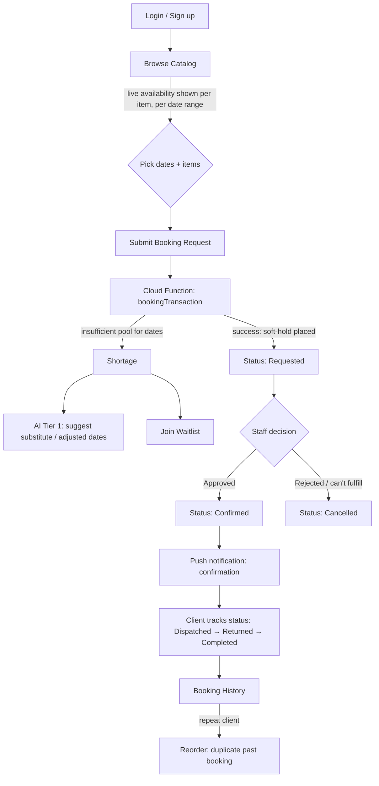
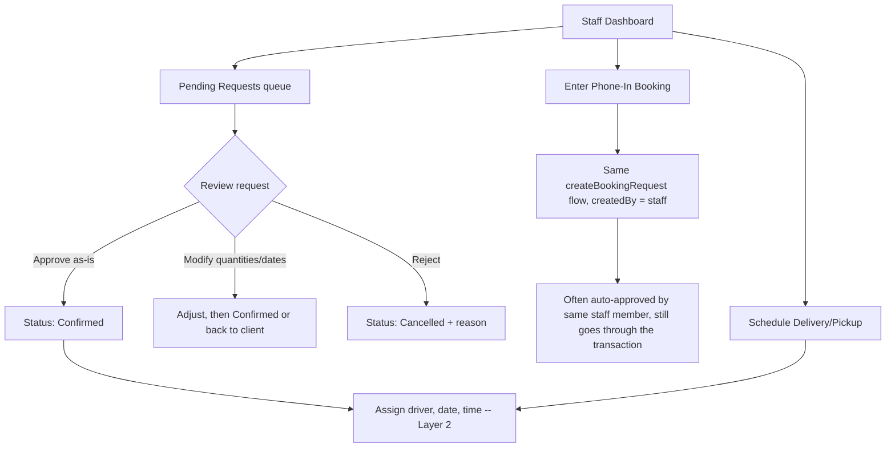
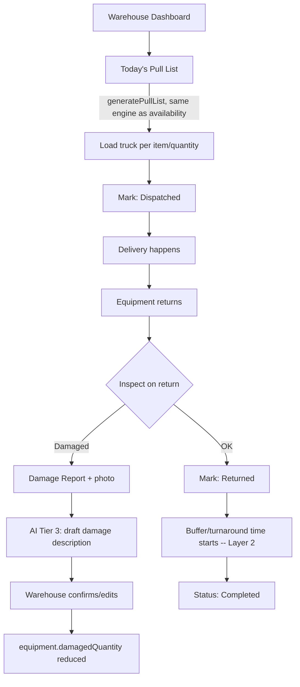
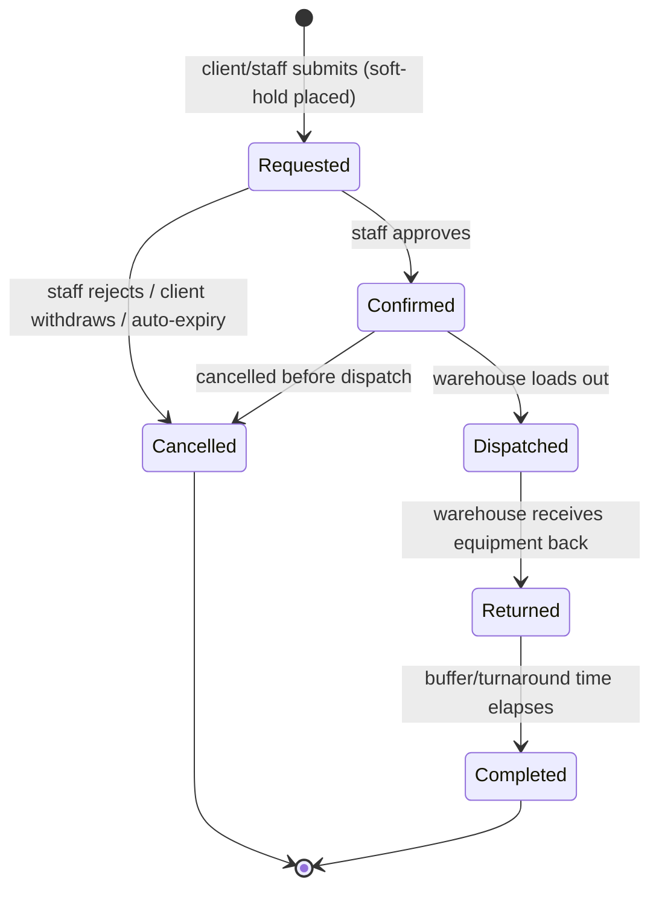

# APPLICATION FLOW
## Equipment Rental Booking & Dispatch App

> Companion to `PROJECT_CONTEXT.md`, `FOLDER_STRUCTURE.md`, `TRD.md`, `DATA_MODEL.md`.
> This file answers: **what actually happens, screen by screen and role by role, from a client wanting equipment to that equipment coming back to the warehouse.**

**Two decisions confirmed for this flow (resolving open items from `PROJECT_CONTEXT.md` §6 / `DATA_MODEL.md` §9):**
1. A **`Requested`** booking places a **soft-hold** on equipment — it counts toward the availability calculation immediately, before any staff approval.
2. Clients see **live availability** while browsing the catalog, not just a silent check on submit.
Update those two files' "Open Questions" sections to reflect this once this doc is approved — flagging it here so the docs don't drift apart, per each file's own closing instruction.

**One new open item this creates** (see §8): if `Requested` holds equipment immediately, a request nobody ever acts on can block real bookings indefinitely. This flow assumes an **auto-expiry** on stale `Requested` holds, but the exact expiry window is not yet decided — flagged, not assumed.

---

## 1. Roles and Entry Points

| Role | Entry point | Primary goal |
|---|---|---|
| **Client** | Public signup/login → client home | Browse, request, track own bookings |
| **Office/Staff** | Staff login → staff dashboard | Enter phone bookings, approve/reject requests, manage day-to-day |
| **Warehouse** | Staff login → warehouse dashboard | Pull lists, load-out, receive returns, damage reports |
| **Admin** | Staff login → admin dashboard | Everything staff can do, plus catalog, users/roles, audit log, overrides |

All four roles authenticate through the same Firebase Auth login screen; the app routes to a different home screen based on the custom claim role (`FOLDER_STRUCTURE.md` §2, `app/lib/core/routing/`). Admin and Staff share most screens, with Admin unlocking a few extra ones — they are not separate codepaths.

---

## 2. Client Flow

### Step-by-step

1. **Browse catalog** — client filters by category (sound/lighting/furniture), picks a date range. Every item shown displays **live remaining quantity for that date range** — computed by the same `checkAvailability` query the booking transaction uses (`PROJECT_CONTEXT.md`'s "one shared engine" rule, `DATA_MODEL.md` §3.4). This is a **read-only** query — no hold is placed just from browsing.
2. **Select items and submit** — client picks quantities per item, adds event details (type, guest count, delivery address), and submits. This calls the `createBookingRequest` Cloud Function — never a direct Firestore write from the client (`TRD.md` §3.2).
3. **Server-side transaction runs immediately on submit** (not deferred to staff review): the same `checkAvailability` logic re-runs inside a Firestore transaction, because a live availability number the client saw seconds ago could already be stale.
   - **If quantity is available:** the booking is created with `status: "Requested"`, and its line items (`bookings/{id}/items`) are written with that same status — which, per the soft-hold decision, **immediately counts against the pool** for any other browsing client or booking attempt.
   - **If quantity is no longer available:** the client does not get a flat rejection. They're offered either an AI-suggested alternative (Tier 1 — substitute equipment or adjusted dates, constrained to real inventory) or a waitlist entry (`waitlist/{id}`, `DATA_MODEL.md` §4.1).
4. **Client waits for staff decision** — sees `status: "Requested"` in their booking history, gets no false confidence that it's locked in yet, but also isn't shown as unavailable to nobody in the meantime (soft-hold protects them).
5. **Staff approves or rejects** (see §3). Client gets a push notification either way.
6. **Tracking through fulfillment** — client sees status update through `Confirmed → Dispatched → Returned → Completed` in real time (Firestore listener, not a manual refresh).
7. **Booking history & reorder** (`Layer 3`) — past bookings, including cancelled ones, stay visible; a "reorder" action duplicates a past booking's line items into a new draft request rather than re-entering everything by hand.

---

## 3. Office/Staff Flow

### Step-by-step

1. **Pending requests queue** — every `Requested` booking, oldest first. Because the soft-hold already reserved the equipment, staff are reviewing *"should this go ahead,"* not racing to grab the equipment before someone else does — that race was already eliminated at submission.
2. **Approve** → Cloud Function `approveBooking` moves `status: Requested → Confirmed`, stamps `approvedBy`/`approvedAt`, and — inside the same transaction — updates every line item's `status` (the denormalized copy, `DATA_MODEL.md` §3.4). An audit log entry is written automatically by the `onBookingStatusChange` trigger, not by this function directly.
3. **Modify before approving** — staff can adjust `quantityConfirmed` down from `quantityRequested` (e.g. only 8 of 10 requested speakers available after a review), which re-runs the availability check for the new numbers before confirming.
4. **Reject** → `status → Cancelled`, `cancelledReason` required, the soft-hold releases immediately (the line items' status change means the next `checkAvailability` query no longer counts them).
5. **Phone-in bookings** — a staff member takes a call and enters the booking directly. This goes through the *exact same* `createBookingRequest` function as a client submission (`createdBy` is the staff's `uid` instead of a client's) — there is no separate "staff booking" code path, because a second path would be exactly the kind of drift that caused the original double-booking problem.
6. **Delivery/pickup scheduling** (`Layer 2`) — once confirmed, staff assign a delivery date/time, pickup date/time, and driver on the booking document.

---

## 4. Warehouse Flow

### Step-by-step

1. **Pull list** — generated from `generatePullList`, which runs the *same underlying query* as the client-facing availability check and the staff dispatch view (`PROJECT_CONTEXT.md`'s core engine philosophy, one query two views) — filtered to bookings with `status: Confirmed` and a delivery date of today/soon. This is what replaces "discovering the conflict while loading the truck."
2. **Load-out** — warehouse checks off items as loaded. Marking the booking `Dispatched` updates both the parent booking and its line items in one transaction.
3. **Return & inspection** — on return, warehouse either marks the booking `Returned` cleanly, or files a **damage report** (`damageReports/{id}`) with a photo.
4. **AI-assisted damage assessment** (Tier 3) — the photo is sent to Claude via a Cloud Function, which drafts a damage description. **Warehouse staff always confirms or edits this before it's saved** — the AI draft never auto-commits a change to `equipment.damagedQuantity` (`DATA_MODEL.md` §4.2, `PROJECT_CONTEXT.md`'s "always re-validate, even if AI already checked" rule).
5. **Buffer/turnaround time** (`Layer 2`) — after `Returned`, the item isn't immediately available again; `equipment.bufferHours` delays when it re-enters the available pool, before the booking finally moves to `Completed`.

---

## 5. Admin Flow

Admin includes everything Staff can do, plus:

| Screen | Purpose |
|---|---|
| **Equipment catalog management** | Add/edit/deactivate equipment, set `totalQuantity`, categories, images |
| **User & role management** | Invite users, assign role (triggers `setCustomClaims` Cloud Function — never client-set) |
| **Audit log viewer** | Read-only view over `auditLogs` — who did what, when, filterable by entity |
| **Override approvals** | Can force-confirm or force-cancel a booking outside the normal staff flow, with a mandatory reason (still writes to `auditLogs`, no override is silent) |
| **Analytics dashboards** | `[Layer 4]` — utilization, revenue, forecasting; not built in Layer 1 |

---

## 6. Cross-Cutting: The Booking Lifecycle State Machine

**Illegal transitions are rejected at the Security Rules layer, not just hidden in the UI** (`DATA_MODEL.md` §7) — e.g. a `Requested` booking cannot be written directly to `Dispatched`, even by an admin-role client call, because that would skip the approval step the whole system is built around.

---

## 7. Notification Triggers (who gets notified, and when)

| Event | Recipient | Channel |
|---|---|---|
| Booking submitted | Staff (new request in queue) | Push (in-app) |
| Booking confirmed | Client | Push |
| Booking rejected | Client | Push, with reason |
| Delivery day approaching | Client | Push/reminder |
| Today's load-out ready | Warehouse | Push |
| Booking dispatched | Client | Push |
| Return overdue | Staff, Warehouse | Push |
| Damage reported | Admin | Push |
| Request about to auto-expire | Client, Staff | Push |

SMS/email channels are listed in the schema (`notifications.channel`) but not wired to a provider yet — push-only for Layer 1, per `TRD.md` §7.

---

## 8. Edge Cases and Flagged Decisions

- **Stale soft-holds:** since `Requested` immediately reserves equipment, an abandoned request could block real demand indefinitely. This flow assumes an **auto-expiry** (e.g. un-actioned requests release their hold after N hours) via a scheduled Cloud Function, but **the exact window is not decided** — needs a decision before `createBookingRequest`/`bookingTransaction` is implemented, since the expiry logic lives inside the same transaction rules.
- **Concurrent approval race:** if two staff members try to approve/reject the same `Requested` booking simultaneously, `approveBooking` runs inside a transaction keyed on the booking's current status — the second attempt reads a status that's already `Confirmed`/`Cancelled` and fails cleanly rather than double-processing.
- **Partial fulfillment on approval:** staff reducing `quantityConfirmed` below `quantityRequested` (§3.3) needs a defined client-facing UX — does the client get asked to accept the reduced amount, or is it auto-accepted? **Not yet decided.**
- **Cancellation after Confirmed but before Dispatched:** releases the hold the same way a rejection does; needs a policy decision on whether this is client-initiated-allowed or staff-only. **Not yet decided.**

---

*Keep this file in sync with the actual Cloud Function names/behavior in `functions/src/`. If a flow changes, update this document in the same PR.*
