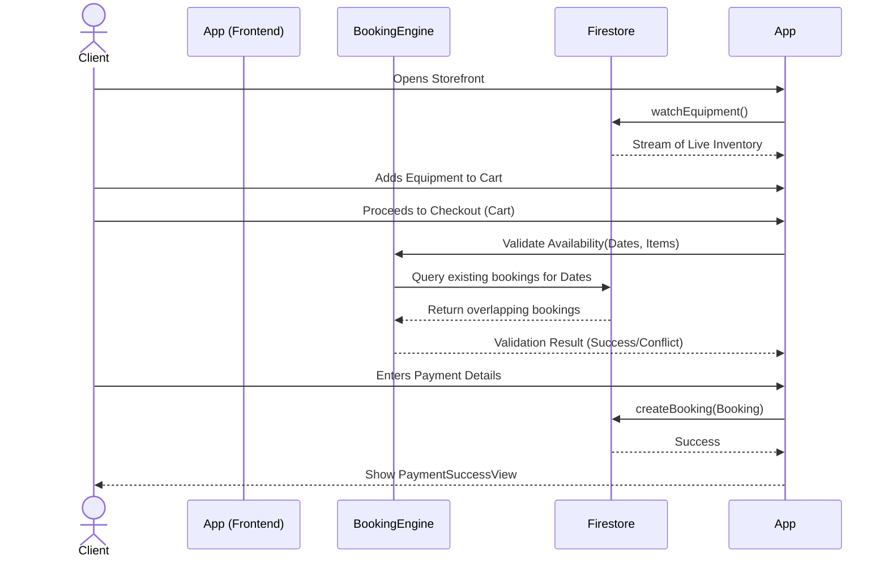

# High-Level Design (HLD): GearGrid Frontend Architecture

## 1. System Overview

**GearGrid** is a premium event equipment rental and inventory management system built with Flutter and Firebase. It facilitates a seamless end-to-end booking flow—from browsing live equipment catalogs and managing an interactive cart, to processing secure payments and tracking dispatch status.

The platform is divided into two primary experiences:
- **Client App (Storefront)**: A sleek, marketing-driven interface where users can browse equipment by category (Sound, Lighting, Visuals, Furniture), build event lists with real-time availability checks, and checkout.
- **Admin App (Dashboard)**: A functional, structured interface for warehouse managers to oversee live inventory, approve bookings, and track equipment dispatch status.

## 2. Architecture & Tech Stack

### Frontend Architecture
- **Framework**: Flutter (Dart)
- **UI Paradigm**: Modular widget composition. Large monolithic screens have been refactored into distinct, single-purpose widgets under `lib/widgets/`.
- **State Management**: Local state combined with reactive streams (`StreamBuilder`) listening to Firestore data.
- **Theming**: Centralized theme files.
  - `ClientTheme` & `LandingTheme`: Used for client-facing and marketing pages (Light mode, Lime & Orange accents).
  - `AdminTheme`: Used for the warehouse dashboard (Dark/Structured, tailored for dense information).

---

## 3. System Components & Flow

### Presentation Layer (Screens)
Located in `lib/screens/`, these orchestrate the high-level user flows.

1. **`landing_screen.dart`**: The marketing entry point. Built with `LandingTheme`. Features animated hero banners, statistics rails, and category showcases.
2. **`auth_screen.dart`**: Handles User/Admin login and registration.
3. **`client_storefront_screen.dart`**: The primary shopping interface. Users view live availability and add items to their cart.
4. **`cart_screen.dart`**: Users review their selected gear, pick rental dates, and see real-time price breakdowns.
5. **`payment_screen.dart`**: Handles checkout phases via distinct tabs (Card, UPI, Wallet) and transitions to a success screen upon validation.
6. **`order_history_screen.dart`**: Allows clients to track the status of past and current bookings.
7. **`home_screen.dart`**: The Admin Dashboard. Allows warehouse staff to add/edit equipment and approve pending bookings.
8. **`profile_settings_screen.dart`**: User preference and account management.

### Component Layer (Widgets)
Located in `lib/widgets/`. To improve maintainability and performance, complex screens are broken down into logical components:
- **`/landing/`**: `LandingHero`, `LandingNavBar`, `LandingCategoryShowcase`, etc.
- **`/payment/`**: `PaymentForm`, `PaymentMethodTabs`, `CardPaymentTab`, etc.
- **`/cart/`**: `CartItemTile`, `PriceBreakdownCard`, `SlotCard`.
- **`/storefront/`**: `StoreHeroBanner`, `EquipmentCatalogCard`, `CategoryRail`.

---

## 4. Sequence Diagram: Booking Flow

